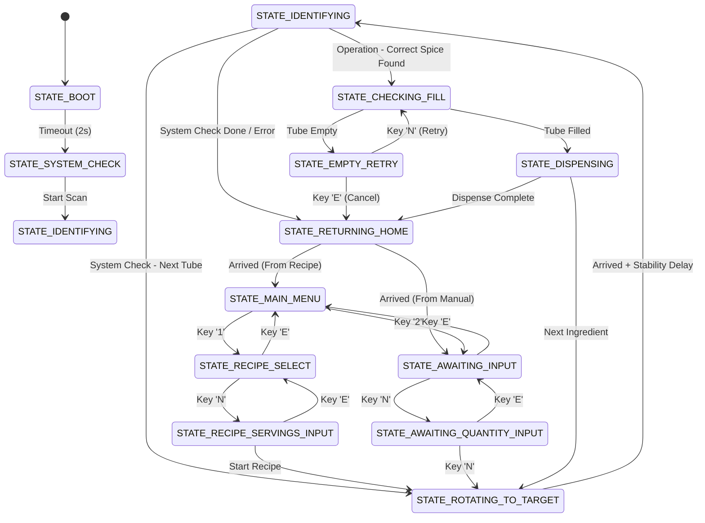

# Spice Dispenser State Machine Documentation

This document describes the asynchronous, non-blocking architecture of the Spice Dispenser firmware. The system is designed to maintain a high loop frequency (<10ms) to ensure responsiveness to BLE commands, especially the Emergency Stop.

## 1. Architectural Overview

The firmware utilizes a **Hierarchical State Machine** approach:
*   **Global State Machine (`main.cpp`)**: Orchestrates high-level machine behavior (Menus, Recipes, Dispensing Flow).
*   **Sub-State Machines (`lib/`)**: Manage specific hardware modules (Dispenser, Color Detector) asynchronously via `tick()` methods.

## 2. Global State Machine

Located in `src/main.cpp`, the global state machine tracks the overall operation.

| State | Description | Transition Trigger |
| :--- | :--- | :--- |
| `STATE_BOOT` | Initial splash and hardware warm-up. | Timeout (2s) -> `STATE_SYSTEM_CHECK` |
| `STATE_SYSTEM_CHECK` | Scans all 20 tubes to verify spice positions. | All tubes verified -> `STATE_MAIN_MENU` |
| `STATE_MAIN_MENU` | Awaiting user choice (Keypad or BLE). | Keypad Input -> `STATE_RECIPE_SELECT` or `STATE_AWAITING_INPUT` |
| `STATE_ROTATING_TO_TARGET` | Moving the carousel to a specific spice tube. | Stepper finished + Stability delay -> `STATE_IDENTIFYING` |
| `STATE_IDENTIFYING` | Color sensing to confirm the spice matches the database. | Color match -> `STATE_CHECKING_FILL` |
| `STATE_CHECKING_FILL` | Laser check for spice level/presence. | Filled -> `STATE_DISPENSING`, Empty -> `STATE_EMPTY_RETRY` |
| `STATE_DISPENSING` | Active servo and vibrator operation. | `isDispensing() == false` -> Next Ingredient or Home |
| `STATE_RETURNING_HOME` | Moving back to Tube 1. | Stepper finished -> `STATE_MAIN_MENU` |

### State Transition Diagram



## 3. Asynchronous Hardware Modules

### 3.1 Dispensing Engine (`lib/Hardware`)
The `tickDispenser()` function runs every loop. It handles the 360° servo sweep and vibration pulses using a timer-based state machine:
1.  **SWEEP_FORWARD**: Increments servo position by 10° every 10ms.
2.  **SWEEP_BACKWARD**: Decrements servo position by 10° every 10ms.
3.  **VIBRATING**: Activates the vibrator pin for exactly 150ms.
4.  **REPEATING**: Decrements the remaining cycle count and restarts until done.

### 3.2 Color Detector (`lib/ColorDetector`)
The `colorDetector.tick()` method performs 5-sample averaging across multiple loop iterations to avoid blocking:
1.  Samples Red -> Green -> Blue with 20ms intervals between transitions to allow sensor stabilization.
2.  Accumulates 5 full RGB sets before calculating the average.
3.  Performs the Euclidean distance match against the `Database.h` spices array.

## 4. Non-Blocking Patterns

### 4.1 Timer-Based Pauses
Instead of `delay()`, we use the `STATE_TIMEOUT(ms)` macro:
```cpp
if (STATE_TIMEOUT(2000)) { 
    changeState(NEXT_STATE); 
}
```
This ensures the CPU is free to process other tasks (like BLE heartbeats) during "waiting" periods.

### 4.2 Keypad & Serial Handling
Keypad polling is performed at the start of each loop. Since the machine is non-blocking, a single key press is captured instantly without jitter or missed inputs during motor movement.
